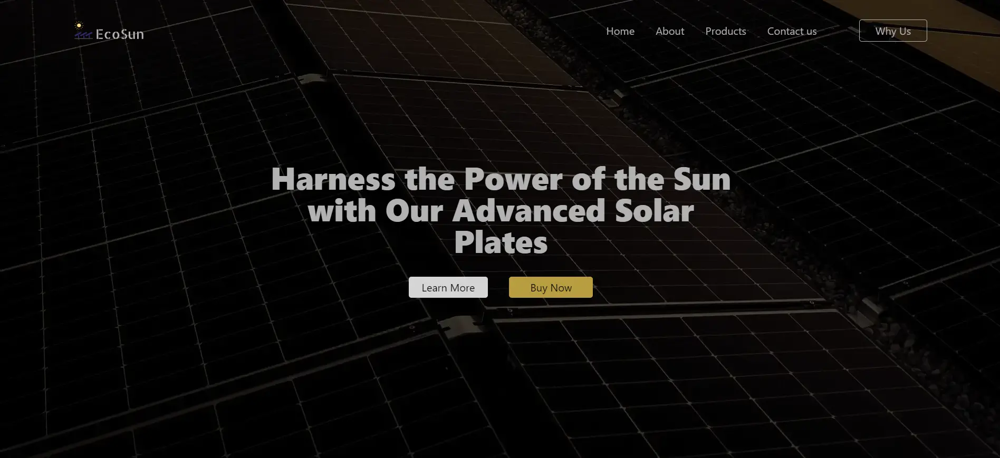

# Solar Web UI

Welcome to the Solar Web UI project! This project features a modern and responsive web interface designed specifically for selling solar panels. The website emphasizes a green and natural environment, integrating transition animations to enhance user experience.

> Note: This is a responsive design created for an internship assignment purpose.

## Project Details

This project was completed as part of an internship assignment. The UI design took approximately 4 hours to complete, and the development using React, Tailwind CSS, and the latest tech stack took around 5 hours.

## Live Demo

[Visit the live site](https://solarwebui.vercel.app/)

## Figma Design

Explore the design details on Figma:

[Figma Design](https://www.figma.com/design/D1IUaP2SGpOVF5Lfw5fyny/Untitled?node-id=0-1&t=Q6Y8d0jLE6zpVbEC-0)

## Images



## Features

- Modern and responsive design
- User-friendly interface
- Optimized for performance
- Cross-browser compatibility

## Installation

To run this project locally, follow these steps:

1. Clone the repository:

   ```bash
   git clone https://github.com/harshKumar029/Solarwebui.git

2. Open File
   cd frontend

3. Run startup command
   npm start
